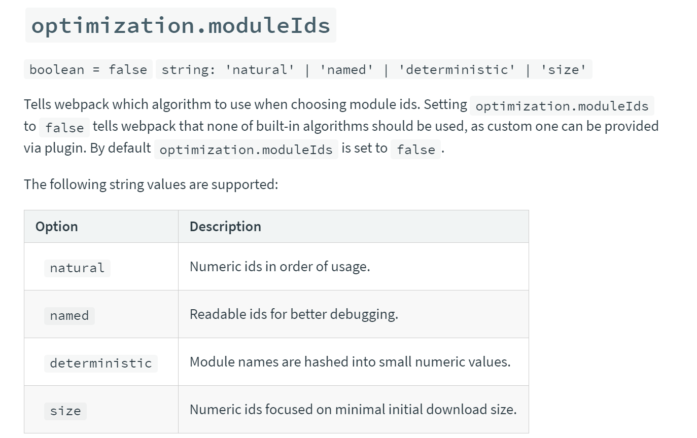

- [1. webapck](#1-webapck)
  - [1.1. 作用](#11-作用)
  - [1.2. 原理](#12-原理)
    - [1.2.1. 依赖关系图](#121-依赖关系图)
    - [1.2.2. 打包](#122-打包)
    - [1.2.3. 实现](#123-实现)
    - [1.2.4. loader & plugin](#124-loader--plugin)
      - [1.2.4.1. 生命周期](#1241-生命周期)
      - [1.2.4.2. diff](#1242-diff)
    - [demo分析](#demo分析)
      - [loader demo 分析](#loader-demo-分析)
      - [plugin demo 分析](#plugin-demo-分析)
  - [1.3. 配置相关](#13-配置相关)
    - [1.3.1. 简化、兼容](#131-简化兼容)
    - [1.3.2. 优化](#132-优化)
  - [1.4. webpack  5](#14-webpack-5)
    - [1.4.1. 持久缓存（Persistent Caching）](#141-持久缓存persistent-caching)
    - [1.4.2. 确定性块和模块 id(Deterministic chunk and module IDs)](#142-确定性块和模块-iddeterministic-chunk-and-module-ids)
    - [1.4.3. 命名块ID(Named chunk IDs)](#143-命名块idnamed-chunk-ids)
    - [1.4.4. NodeJS的polyfill脚本被移除(Automatic Node.js polyfills removed)](#144-nodejs的polyfill脚本被移除automatic-nodejs-polyfills-removed)
    - [1.4.5 Runtime Modules](#145-runtime-modules)
    - [1.4.6 Hook Object Frozen](#146-hook-object-frozen)
    - [1.4.7 优化](#147-优化)
    - [参考](#参考)

# 1. webapck

webpack 是一个现代 JavaScript 应用程序的静态模块打包器(module bundler)。当 webpack 处理应用程序时，它会递归地构建一个依赖关系图(dependency graph)，其中包含应用程序需要的每个模块，然后将所有这些模块打包成一个或多个 bundle。

## 1.1. 作用
构建工具就是将源代码转换成可执行的 JavaScript、CSS、HTML 代码，包括以下内容：

+ 代码转换：

将 TypeScript 编译成 JavaScript、将 SCSS 编译成 CSS 等；


+ 文件优化

压缩 JavaScript、CSS、HTML 代码，压缩合并图片等；


+ 代码分割

提取多个页面的公共代码，提取首屏不需要执行部分的代码，让其异步加载；


+ 模块合并

在采用模块化的项目里会有很多个模块和文件，需要通过构建功能将模块分类合并成一个文件；


+ 自动刷新

监听本地源代码的变化，自动重新构建、刷新浏览器；


+ 代码校验

在代码被提交到仓库前需要校验代码是否符合规范，以及单元测试是否通过；
  eslint-loader、
  eslint-plugin-html、
  slint-friendly-formatter、


+ 自动发布

更新代码后，自动构建出线上发布代码并传输给发布系统；
  webpack-deploy-sftp

## 1.2. 原理

+ 读取入口文件（entry），然后递归查找所依赖的模块(module)，构建成一个“依赖图”，
+ 然后根据配置中的加载器(loader)和打包策略来对模块进行编译。
+ 字符串组合，导出打包文件

### 1.2.1. 依赖关系图

+ 入口文件定义
    + 默认值为项目路径下 ./src
    + 通过脚手架命令指定
    + 通过webpack config文件指定
+ 获取依赖

[DEMO](./example/miniwebpack/entry.js)

```javascript
const fs = require('fs');
const path = require('path');
const babylon = require('babylon');
const traverse = require('babel-traverse').default;
const {transformFromAst} = require('babel-core');

let ID = 0;

// 该函数将接受 文件路径 ,读取内容并提取它的依赖关系.
function createAsset(filename) {
  // 以字符串形式读取文件的内容.
  const content = fs.readFileSync(filename, 'utf-8');
  //   现在我们试图找出这个文件依赖于哪个文件. 我们可以通过查看其内容
  //   使用Babylon解析、获取  `import` 字符串.
  const ast = babylon.parse(content, {
    sourceType: 'module',
  });

  // 这个数组将保存这个模块依赖的模块的相对路径.
  const dependencies = [];

  //   遍历`ast`来试着理解这个模块依赖哪些模块.
  //   我们检查`ast`中的每个 `import` 声明. 
  traverse(ast, {
    // 找到`import`声明时,我们都可以将其数值视为`依赖性`.
    ImportDeclaration: ({node}) => {
      // 我们将依赖关系数组推入我们导入的值. ⬅️
      dependencies.push(node.source.value);
    },
  });

  //   通过递增简单计数器为此模块分配唯一标识符.
  const id = ID++;

  //   为了确保`我们的bundle`在所有浏览器中运行,
  //   用`babel-preset-env``将我们的代码转换为浏览器可以运行的东西.
  const {code} = transformFromAst(ast, null, {
    presets: ['env'],
  });

  // 返回有关此模块的所有信息.
  return {
    id,
    filename,
    dependencies,
    code,
  };
}
```

导出的结果如下：

```javascript
{ 
    id: 0,
    filename: './example/entry.js',
    dependencies: [ './message.js' ],
    code: '"use strict";\n\nvar _message = require("./message.js");\n\nvar _message2 = _interopRequireDefault(_message);\n\nfunction _interopRequireDefault(obj) { return obj && obj.__esModule ? obj : { default: obj }; }\n\nconsole.log(_message2.default);'
}
```

**迭代**

```javascript
// 现在我们可以提取单个模块的依赖关系,我们将通过提取`入口文件{entry}`的依赖关系来解决问题.
// 那么,我们将提取它的每一个依赖关系的依赖关系. 循环下去
// 直到我们了解应用程序中的每个模块以及它们如何相互依赖. 即`依赖图`.
function createGraph(entry) {
  // 首先解析入口文件.
  const mainAsset = createAsset(entry);

  //   我们将使用`队列{queue}`来解析每个`模块`的依赖关系.
  //   初始化一个只有 入口模块的数组.
  const queue = [mainAsset];

  // 循环遍历 待解析模块的任务队列.
  for (const asset of queue) {
    //  给模块挂载mapping属性，记录它所依赖模块的相对路径列表.
    asset.mapping = {};

    // 这是这个模块所在的目录.
    const dirname = path.dirname(asset.filename);

    // 我们遍历其相关路径的列表
    asset.dependencies.forEach(relativePath => {
      // relativePath是相对路径，
      // 我们可以通过将相对路径与父资源目录的路径连接,将相对路径转变为绝对路径.
      const absolutePath = path.join(dirname, relativePath);

      // 解析模块,读取其内容并提取其依赖关系.
      const child = createAsset(absolutePath);

      //   了解`asset`依赖取决于`child`这一点对我们来说很重要.
      //   通过给`asset.mapping`对象增加一个新的属性(值为child.id)来表达这种一一对应的关系.
      asset.mapping[relativePath] = child.id;

      // 最后,我们将`child`这个资产推入队列,这样它的依赖关系也将被迭代和解析.
      queue.push(child);
    });
  }

  //   到这一步,队列 就是一个包含目标应用中 每个模块 的数组:
  //   这就是我们的表示图.
  return queue;
}

```

获得依赖图，结构如下：

```javascript
[
  { id: 0,
    filename: './example/entry.js',
    dependencies: [ './message.js' ],
    code: '"use strict";\n\nvar _message = require("./message.js");\n\nvar _message2 = _interopRequireDefault(_message);\n\nfunction _interopRequireDefault(obj) { return obj && obj.__esModule ? obj : { default: obj }; }\n\nconsole.log(_message2.default);',
    mapping: { './message.js': 1 } 
  },
  { id: 1,
    filename: 'example\\message.js',
    dependencies: [ './name.js' ],
    code: '"use strict";\n\nObject.defineProperty(exports, "__esModule", {\n  value: true\n});\n\nvar _name = require("./name.js");\n\nexports.default = "hello " + _name.name + "!";',
    mapping: { './name.js': 2 } 
  },
  { id: 2,
    filename: 'example\\name.js',
    dependencies: [],
    code: '"use strict";\n\nObject.defineProperty(exports, "__esModule", {\n  value: true\n});\nvar name = exports.name = \'world\';',
    mapping: {}
  }
]
```

### 1.2.2. 打包

根据依赖图

```javascript
// 接受依赖图作为输入
function bundle(graph) {
  let modules = '';
  // 遍历依赖图，将依赖图转换为 js对象， key 是模块id， value组成是[ 模块定义code, 依赖描述mapping ]
  graph.forEach(mod => {
    // 模块定义code：使用commonjs模块系统: 接受require、module、exports作为输入.

    // 用stringify转化mapping字段，解析后如: {'./relative/path': 1}
    modules += `${mod.id}: [
      function (require, module, exports) { ${mod.code} },
      ${JSON.stringify(mod.mapping)},
    ],`;
  });

  // 通过上面的code，我们将依赖图中的木块都定义成了commonjs模块，而且记录了对应模块的依赖项，方便记载时查找依赖
  // 最后我们需要一个自执行函数，从入口开始加载：假设加载函数是require，入口模块id必然为0，因此，调用require(0)即可；
  // 但是commonjs当中的接收的require可不是通过id来加载的，而是相对路径，这个时候需要通过mapping做映射，同时定义localRequire作为commonjs的require入参；
  
  const result = `
    (function(modules) {
      function require(id) {
        const [fn, mapping] = modules[id];

        function localRequire(name) {
          return require(mapping[name]);
        }

        const module = { exports : {} };

        fn(localRequire, module, module.exports); 

        return module.exports;
      }

      require(0);
    })({${modules}})
  `;
  return result;
}

```

最后得到的js代码如下：

```javascript
(function(modules) {
    function require(id) {
        const [fn, mapping] = modules[id];

        function localRequire(name) {
          return require(mapping[name]);
        }

        const module = { exports : {} };

        fn(localRequire, module, module.exports);

        return module.exports;
    }

    require(0);

})(
    {
        0: [
                function (require, module, exports) { "use strict";

                    var _message = require("./message.js");

                    var _message2 = _interopRequireDefault(_message);

                    function _interopRequireDefault(obj) { return obj && obj.__esModule ? obj : { default: obj }; }

                    console.log(_message2.default); 
                },
                {
                    "./message.js":1
                },
        ],
        1: [
                function (require, module, exports) { "use strict";

                    Object.defineProperty(exports, "__esModule", {
                      value: true
                    });

                    var _name = require("./name.js");

                    exports.default = "hello " + _name.name + "!"; 
                },
                {
                    "./name.js":2
                },
        ],
        2: [
                function (require, module, exports) { "use strict";

                    Object.defineProperty(exports, "__esModule", {
                      value: true
                    });
                    var name = exports.name = 'world';
                },
                {}
        ]
    }
)

```


### 1.2.3. 实现

上面只是最简单的一个类似webpack的打包器的实现，真正的实现要复杂许多，因为要提供许多loader、plugin等等实现功能扩展；

webpack本质上是一种事件流的机制，它的工作流程就是将各个插件串联起来，而实现这一切的核心就是Tapable，webpack中最核心的负责编译的Compiler和负责创建bundles的Compilation都是Tapable的实例。Tapable就像nodejs中EventEmitter,提供对事件的注册on和触发emit。

[DEMO](./example/tapable/index.js)

### 1.2.4. loader & plugin

#### 1.2.4.1. 生命周期


#### 1.2.4.2. diff

+ loader 让 webpack 能够去处理那些非 JavaScript 文件（webpack 自身只理解 JavaScript）。loader 可以将所有类型的文件转换为 webpack 能够处理的有效模块，然后你就可以利用 webpack 的打包能力，对它们进行处理。

+ 插件的范围包括，从打包优化和压缩，一直到重新定义环境中的变量。插件接口功能极其强大，可以用来处理各种各样的任务。

[plugin hooks](https://webpack.docschina.org/api/plugins/#tapable)
  
**The difference between a plugin and a loader is that a loader can only transform a single file just before it’s added to the dependency graph.**

### demo分析

#### loader demo 分析
loader就是一个export出来的function，这个函数接受的参数是源文件的字符串，返回经过“翻译”后的文件。

第一个执行的loader接收源文件内容作为参数，其他loader接收前一个执行的loader的返回值作为参数。最后执行的loader会返回此模块的JavaScript源码

+ 配置

```javascript
module: {
    //加载器配置
    loaders:[
        {
            test: /\.tpl\.html$/,
            loader: 'my-template-loader'
        }
    ]
}
```

+ 同步loader
  + 最简单的loader，直接返回源代码：ex1
  + 返回其他结果，如sourceMap等;ex2

ex1:
```javascript
  const loaderUtils = require('loader-utils');
    module.exports = function(source) {
    // 获取到用户给当前 Loader 传入的 options
    const options = loaderUtils.getOptions(this);
    return source;
    /*
    return `module.exports = {
        tpl: '<html><body><p>${content}</p></body></html>'
    }`;
     */
};
```
ex2:
```javascript
  this.callback(
    // 当无法转换原内容时，给 Webpack 返回一个 Error
    err: Error | null,
    // 原内容转换后的内容
    content: string | Buffer,
    // 用于把转换后的内容得出原内容的 Source Map，方便调试
    sourceMap?: SourceMap,
    // 如果本次转换为原内容生成了 AST 语法树，可以把这个 AST 返回，
    // 以方便之后需要 AST 的 Loader 复用该 AST，以避免重复生成 AST，提升性能
    abstractSyntaxTree?: AST
);
```

Loader 有同步和异步之分，上面介绍的 Loader 都是同步的 Loader，因为它们的转换流程都是同步的，转换完成后再返回结果。

+ 异步loader

有些场景下转换的步骤只能是异步完成的，例如你需要通过网络请求才能得出结果，如果采用同步的方式网络请求就会阻塞整个构建，导致构建非常缓慢。

```javascript
module.exports = function(source) {
    // 告诉 Webpack 本次转换是异步的，Loader 会在 callback 中回调结果
    var callback = this.async();
    someAsyncOperation(source, function(err, result, sourceMaps, ast) {
        // 通过 callback 返回异步执行后的结果
        callback(err, result, sourceMaps, ast);
    });
};
```


**Source Map 的生成很耗时，通常在开发环境下才会生成 Source Map，其它环境下不用生成，以加速构建。
为此 Webpack 为 Loader 提供了 this.sourceMap API 去告诉 Loader 当前构建环境下用户是否需要 Source Map。**

+ 常用loader api

  + this.cacheable(Boolean)： 是否开启缓存
  + this.context：当前处理文件的所在目录，假如当前Loader处理的文件是/src/main.js，则this.context就等于/src。
  + this.resource：当前处理文件的完整请求路径，包括querystring，例如/src/main.js?name=1。
  + this.resourcePath：当前处理文件的路径，例如/src/main.js。
  + this.resourceQuery：当前处理文件的querystring。
  + this.target：等于Webpack配置中的Target。
  + this.loadModule：当Loader在处理一个文件时，如果依赖其它文件的处理结果才能得出当前文件的结果时， 就可以通过this.loadModule(request: string, callback: function(err, source, sourceMap, module))去获得request对应文件的处理结果。
  + this.resolve：像require语句一样获得指定文件的完整路径，使用方法为resolve(context: string, request: string, callback: function(err, result: string))。
  + this.addDependency：给当前处理文件添加其依赖的文件，以便再其依赖的文件发生变化时，会重新调用Loader处理该文件。使用方法为addDependency(file: string)。
  + this.addContextDependency：和addDependency类似，但addContextDependency是把整个目录加入到当前正在处理文件的依赖中。使用方法为addContextDependency(directory: string)。
  + this.clearDependencies：清除当前正在处理文件的所有依赖，使用方法为clearDependencies()。
  + this.emitFile：输出一个文件，使用方法为emitFile(name: string, content: Buffer|string, sourceMap: {...})

+ 开发tips(加载本地Loader)
  + **npm link**
  + **resolveLoader**
```javascript
module.exports = {
  resolveLoader:{
    // 去哪些目录下寻找 Loader，有先后顺序之分
    modules: ['node_modules','./loaders/'],
  }
}
```

  

#### plugin demo 分析

+ 开发步骤:

  + 编写一个JavaScript class
  + 在class里面写一个apply方法，这个方法接收一个参数compiler，表示这次打包的上下文。
  + 指定挂载的webpack事件钩子。
  + 处理webpack内部实例的特定数据。
  + 功能完成后调用webpack提供的回调。


+ Compiler和Compilation
  在开发Plugin时最常用的两个对象就是Compiler和Compilation，它们是Plugin和Webpack之间的桥梁。Compiler和Compilation的含义如下：

  + Compiler对象包含了Webpack环境所有的的配置信息，包含options，loaders，plugins这些信息，这个对象在Webpack启动时候被实例化，它是全局唯一的，可以简单地把它理解为Webpack实例；

  + Compilation对象包含了当前的模块资源、编译生成资源、变化的文件等。当Webpack以开发模式运行时，每当检测到一个文件变化，一次新的Compilation将被创建。Compilation对象也提供了很多事件回调供插件做扩展。通过Compilation也能读取到Compiler对象。
  + Compiler和Compilation的区别在于：Compiler代表了整个Webpack从启动到关闭的生命周期，而Compilation只是代表了一次新的编译。

```javascript
/**
* 广播出事件
* event-name 为事件名称，注意不要和现有的事件重名
* params 为附带的参数
*/
compiler.apply('event-name',params);

/**
* 监听名称为 event-name 的事件，当 event-name 事件发生时，函数就会被执行。
* 同时函数中的 params 参数为广播事件时附带的参数。
*/
compiler.plugin('event-name',function(params) {

});
```

[webpack-manifest-plugin](https://github.com/danethurber/webpack-manifest-plugin/blob/master/lib/plugin.js)

服务器端构造的html，就可以根据当前的manifest，引入css和js文件，而且这个文件是必须的，否则服务器端压根不知道hash之后的JS文件名字和CSS名字。


## 1.3. [配置相关](https://www.webpackjs.com/concepts/)

### 1.3.1. 简化、兼容

+ 多入口:[name/hash/chunkhash/id/contenthash/query];
+ 命名
+ 多端适配
+ 引用路径:alias, resolve;
+ 打包模式:
"var" | "module" | "assign" | "this" | "window" | "self" | "global" | "commonjs" | "commonjs2" | "commonjs-module" | "amd" | "amd-require" | "umd" | "umd2" | "jsonp" | "system"


### 1.3.2. [优化](https://www.webpackjs.com/plugins/)

+ 文件切割 CommonsChunkPlugin
+ ...

## 1.4. [webpack  5](https://github.com/webpack/changelog-v5/blob/master/README.md#changes-to-the-configuration)

nodejs 10.13.0(LTS).

### 1.4.1. 持久缓存（Persistent Caching）

```javascript
cache: {
  // 1. Set cache type to filesystem
  type: "filesystem",
  
  buildDependencies: {
    // 2. Add your config as buildDependency to get cache invalidation on config change
    config: [__filename]
  
    // 3. If you have other things the build depends on you can add them here
    // Note that webpack, loaders and all modules referenced from your config are automatically added
  }
}
```
[cache](.\node_modules\.cache\webpack\default-none.pack)
  + 1. **保证hash值的唯一性** ，即为每个打包后的资源生成一个独一无二的 hash 值，只要打包内容不一致，那么 hash 值就不一致。

  + 2. **保证hash值的稳定性** ，我们需要做到修改某个模块的时候，只有受影响的打包后文件 hash 值改变，与该模块无关的打包文件 hash 值不变。

**hash & chunkhash**

hash 代表每次 webpack 在编译的过程中会生成唯一的 hash 值，在项目中任何一个文件改动后就会被重新创建，然后 webpack 计算新的 hash 值。

chunkhash 是根据模块计算出来的 hash 值，所以某个文件的改动只会影响它本身的 hash 值，不会影响其他文件。所以如果你只是单纯地将所有内容打包成同一个文件，那么 hash 就能够满足你了，如果你的项目涉及到拆包，分模块进行加载等等，那么你需要用 chunkhash，来保证每次更新之后只有相关的文件 hash 值发生改变。

影响 chunkhash 值变化主要由以下四个部分引起的：

+ 包含模块的源代码;
+ webpack 用于启动运行的 runtime 代码;
+ webpack 生成的模块 moduleid(包括包含模块 id 和被引用的依赖模块 id);
+ chunkID;

    
**开发调试过程编译速度加快： 当检测到某个文件变化时，依照“依赖图”，只对修改过的文件进行编译，从而大幅提高了编译速度。**

### 1.4.2. 确定性块和模块 id(Deterministic chunk and module IDs)

为了增强long-term caching，增加了新的算法，这些算法以确定性的方式为模块和数据块分配非常短(3或4个字符)的数字 id。 这是捆绑包大小和长期缓存之间的权衡。生产环境默认开启



[refer](https://webpack.js.org/configuration/optimization/#optimizationchunkids)


```javascript
{
    ......
    chunkIds: "deterministic",
    moduleIds: "deterministic"
}
```

### 1.4.3. 命名块ID(Named chunk IDs)

命名chunk id算法，编译后的chunk名称可读性大大加强。模块ID(Module ID)由其相对于上下文的路径而确定，代码块ID(Chunk ID)由其内容来决定。

默认情况下，在开发模式中启用了一个新命名的块 id 算法，该算法提供块(以及文件名)可读的引用。 模块 ID 由其相对于上下文的路径确定。 块 ID 是由块的内容决定的

```javascript
{
  ......
  chunkIds: "named"
}
```
**在生产环境中使用 chunkIds:"named"是可能的，只是确保不会意外地暴露有关模块名称的敏感信息。**


### 1.4.4. NodeJS的polyfill脚本被移除(Automatic Node.js polyfills removed)

    最开始，webpack的目标是允许在浏览器中运行大多数的Node模块，但是现在模块格局已经发生了重大变化，现在有很多模块是专门为前端开发的。在v4及以前的版本中，对于大多数的Node模块将自动添加polyfill脚本（腻子脚本）。

然而，这些大量繁杂的脚本都会添加到最终编译的代码中(bundle)，但其实通常情况下是没有必要的。在v5版本中将尝试停止自动地添加polyfill脚本，转而专注于前端兼容模块。


### 1.4.5 Runtime Modules
若不需要加载别的module，实际不需要__webpack_require__这部分代码，所以在webpack5 会自动进行检测，判断是否需要加入runtime代码

### 1.4.6 Hook Object Frozen
原有添加自定义hook事件的方式不在适用，因为hook object 通过[Object.freeze()](https://developer.mozilla.org/en-US/docs/Web/JavaScript/Reference/Global_Objects/Object/freeze)定义，不允许新添加属性或者方法；

**HtmlWebpackPlugin就因为这个无法正常工作**

### 1.4.7 优化

**tree-shaking**

+ Nested tree-shaking
```javascript
// inner.js
export const a = 1;
export const b = 2;

// module.js
import * as inner from "./inner";
export { inner }

// user.js
import * as module from "./module";
console.log(module.inner.a);
```
变量b的定义将被剔除（生产环境）；

+ Inner-module tree-shaking

webpack 4 不分析模块的export和import之间的关系；

```javascript
import { something } from "./something";

function usingSomething() {
  return something;
}

export function test() {
  return usingSomething();
}
```
webpack5 中，将会分析依赖图：如果test函数被导出使用时才会用到something模块；设定webpack配置：**sideEffects": false**配置，当test没有被导出使用，something将被丢弃


### 参考
+ [Webpack原理—编写Loader和Plugin](https://www.jianshu.com/p/c021b78c9ef2)